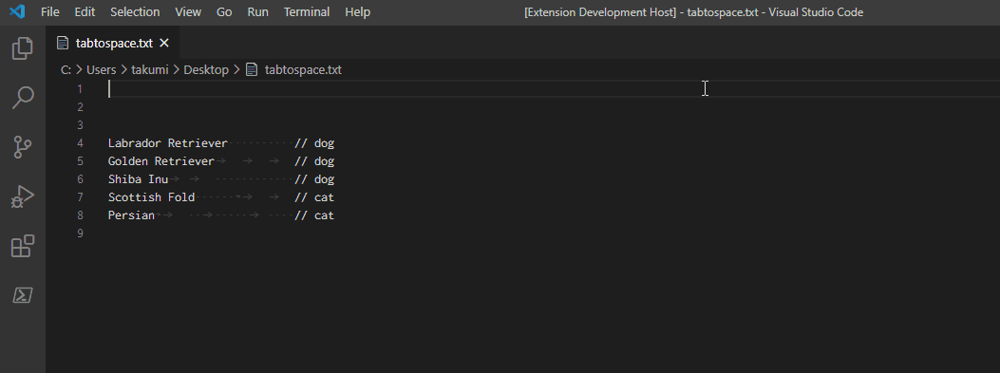

# Tab to Space

Convert all tabs to indentation using spaces.

## 1. Features

| Title                                         | Command          | Default Keybinding | In the Editor Right Click Menu |
| :-------------------------------------------- | :--------------- | :----------------- | :----------------------------- |
| Convert all tabs to indentation using spaces. | tabspace.convert |                    | No                             |

---

## 2. Demo

### 2.1. Convert

**Convert all tabs to indentation using spaces.**

- 

## 3. Extension Settings

This extension has no settings.

## 4. Policy

- Welcome bug reports, feature requests, pull requests
    - Please add reploduction steps or example on the bug reports.
- Forcused on support full-width characters
    - Because author is Japanese

## 5. Release Notes

### - 0.0.1 (2020/11/11)

- [Add] Align column/columns commands

## 6. Links

- [Source Code](https://github.com/takumisoft68/vscode-tab-to-space)
- [Marketplace](https://marketplace.visualstudio.com/items?itemName=TakumiI.tabspace)
